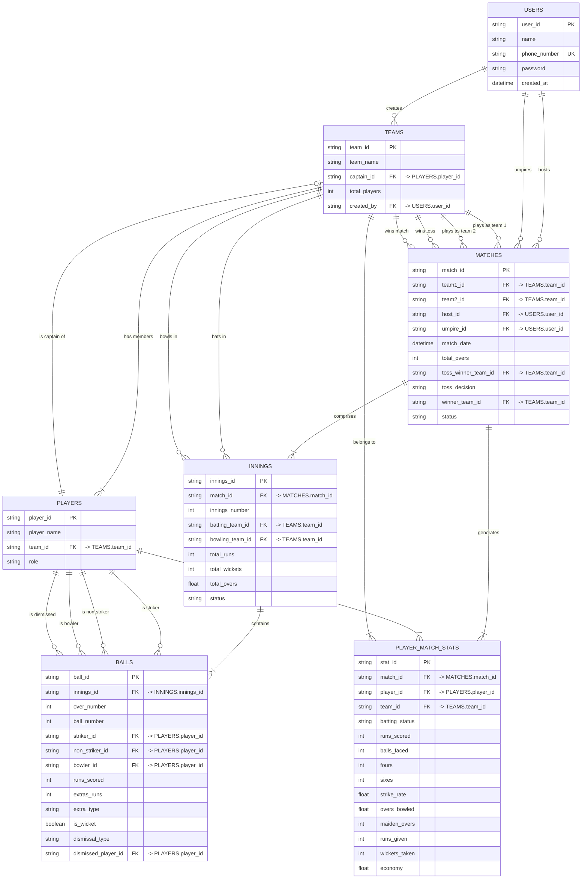

# Cricket Scoring and Match Management System - ER Diagram

```mermaid
erDiagram
    %% Core Relationships
    USERS ||--o{ TEAMS : "creates"
    USERS ||--o{ MATCHES : "hosts"
    USERS ||--o{ MATCHES : "umpires"

    TEAMS ||--|{ PLAYERS : "has members"
    PLAYERS ||--o| TEAMS : "is captain of"

    TEAMS ||--o{ MATCHES : "plays as team 1"
    TEAMS ||--o{ MATCHES : "plays as team 2"
    TEAMS ||--o{ MATCHES : "wins toss"
    TEAMS ||--o{ MATCHES : "wins match"

    MATCHES ||--|{ INNINGS : "comprises"
    TEAMS ||--o{ INNINGS : "bats in"
    TEAMS ||--o{ INNINGS : "bowls in"

    INNINGS ||--|{ BALLS : "contains"
    
    PLAYERS ||--o{ BALLS : "is striker"
    PLAYERS ||--o{ BALLS : "is non-striker"
    PLAYERS ||--o{ BALLS : "is bowler"
    PLAYERS ||--o{ BALLS : "is dismissed"

    MATCHES ||--|{ PLAYER_MATCH_STATS : "generates"
    PLAYERS ||--|{ PLAYER_MATCH_STATS : "records"
    TEAMS ||--|{ PLAYER_MATCH_STATS : "belongs to"

    %% Entity Definitions
    USERS {
        string user_id PK
        string name
        string phone_number UK
        string password
        datetime created_at
    }

    TEAMS {
        string team_id PK
        string team_name
        string captain_id FK "-> PLAYERS.player_id"
        int total_players
        string created_by FK "-> USERS.user_id"
    }

    PLAYERS {
        string player_id PK
        string player_name
        string team_id FK "-> TEAMS.team_id"
        string role
    }

    MATCHES {
        string match_id PK
        string team1_id FK "-> TEAMS.team_id"
        string team2_id FK "-> TEAMS.team_id"
        string host_id FK "-> USERS.user_id"
        string umpire_id FK "-> USERS.user_id"
        datetime match_date
        int total_overs
        string toss_winner_team_id FK "-> TEAMS.team_id"
        string toss_decision
        string winner_team_id FK "-> TEAMS.team_id"
        string status
    }

    INNINGS {
        string innings_id PK
        string match_id FK "-> MATCHES.match_id"
        int innings_number
        string batting_team_id FK "-> TEAMS.team_id"
        string bowling_team_id FK "-> TEAMS.team_id"
        int total_runs
        int total_wickets
        float total_overs
        string status
    }

    BALLS {
        string ball_id PK
        string innings_id FK "-> INNINGS.innings_id"
        int over_number
        int ball_number
        string striker_id FK "-> PLAYERS.player_id"
        string non_striker_id FK "-> PLAYERS.player_id"
        string bowler_id FK "-> PLAYERS.player_id"
        int runs_scored
        int extras_runs
        string extra_type
        boolean is_wicket
        string dismissal_type
        string dismissed_player_id FK "-> PLAYERS.player_id"
    }

    PLAYER_MATCH_STATS {
        string stat_id PK
        string match_id FK "-> MATCHES.match_id"
        string player_id FK "-> PLAYERS.player_id"
        string team_id FK "-> TEAMS.team_id"
        string batting_status
        int runs_scored
        int balls_faced
        int fours
        int sixes
        float strike_rate
        float overs_bowled
        int maiden_overs
        int runs_given
        int wickets_taken
        float economy
    }
```
